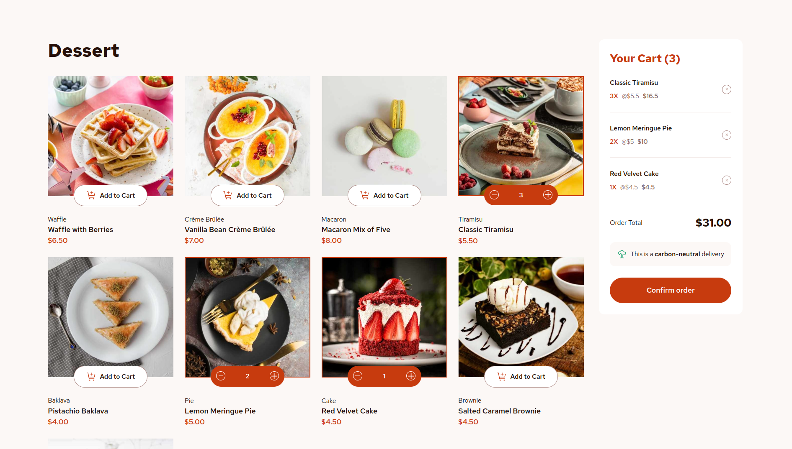

# Frontend Mentor - Product list with cart solution

This is a solution to the [Product list with cart challenge on Frontend Mentor](https://www.frontendmentor.io/challenges/product-list-with-cart-5MmqLVAp_d). Live site can be see [here]()

### The challenge

Users should be able to:

- Add items to the cart and remove them
- Increase/decrease the number of items in the cart
- See an order confirmation modal when they click "Confirm Order"
- Reset their selections when they click "Start New Order"
- View the optimal layout for the interface depending on their device's screen size
- See hover and focus states for all interactive elements on the page

### Screenshot

### Links

- Solution URL: [Solution URL - FrontendMentor](https://your-solution-url.com)
- Live Site URL: [Live Site URL](https://your-live-site-url.com)

### Built with

- [React](https://reactjs.org/) - JS library
- CSS Modules
- Typescript

## Author

- Frontend Mentor - [@thibault-deverge](https://www.frontendmentor.io/profile/thibault-deverge)
